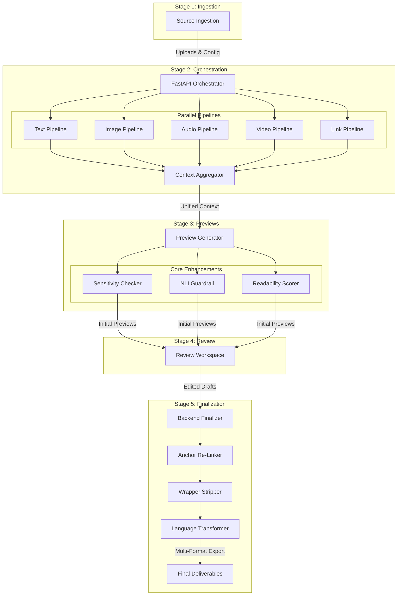

# Transmute AI — Multimodal Threat Intelligence & Content Synthesis Platform

[](https://www.python.org/downloads/)
[](https://fastapi.tiangolo.com)
[](https://react.dev/)
[](https://vitejs.dev/)
[](https://tailwindcss.com/)
[](https://groq.com/)

**Transmute AI** is an enterprise-grade agentic AI threat intelligence dissemination platform. It ingests heterogeneous, multimodal cyber intelligence—spanning raw text reports, PDFs, system logs, screenshots, incident call recordings, video briefings, and web links—and deterministically transforms them into audience-tailored, production-ready security deliverables.

Every synthesized artifact is anchored to source telemetry with **100% deterministic grounding**, **bidirectional citation provenance**, **interactive inline sensitivity redaction**, **multilingual translation (Hindi, Telugu, English)**, and **multi-format export packaging (.md, .txt, .pdf, .docx, .zip)**.

---

## Key Features

- **46+ Format Multimodal Ingestion:**
  - **Documents & Text:** AST-preserving extraction via `PyMuPDF` / `PyMuPDF4LLM` with table syntax preservation.
  - **Images & OCR:** Tesseract OCR and Gemini Flash Vision keypoint extraction with normalized bounding box geometry `[ymin, xmin, ymax, xmax]`.
  - **Audio Streams:** High-speed speech-to-text with word-level timestamps using `faster-whisper`.
  - **Video Analysis:** Keyframe extraction via OpenCV & PySceneDetect combined with Whisper transcription and visual scene interpretation.
  - **Live Web Scraping:** Dedicated web link ingestion pipeline extracting clean article markdown and deterministic IOCs (CVEs, IPs, hashes, MITRE ATT&CK techniques).

- **Deterministic Fact Grounding (Zero Hallucination):**
  - Synthesizes an intermediate canonical **Dual-Payload Context Bundle** (clean markdown + structured JSON metadata) to eliminate synthetic hallucinations and cross-agent drift.
  - All claims reference verified source entities, timestamps, and bounding boxes.

- **The 4 Core Enhancement Engines:**
  1. **Deterministic Sensitivity Checker:** Pre-review Aho-Corasick automaton and Shannon entropy scanner that pinpoints RFC1918 IPs, API keys, passwords, and PII with non-destructive character offset mapping.
  2. **NLI Cross-Encoder Guardrail:** Natural Language Inference verification engine checking factual entailment between generated sentences and originating evidence.
  3. **Anchor Re-Linker:** Dynamic citation maintenance engine that preserves claim-to-source mappings when text is edited by human operators.
  4. **Readability & Tone Scorer:** Multi-metric scoring (Flesch-Kincaid, Flesch Reading Ease, Gunning Fog) calibrated to each target audience.

- **Interactive Dual-Pane Review Workspace:**
  - **Left Pane (Evidence Inspector):** Interactive visual bounding box canvas for OCR, timestamped evidence cards, and live search filtering.
  - **Right Pane (Preview Editor):** Inline sensitivity badges with operator decision popovers (**Redact**, **Accept**, **Delete**) protected against offset drift.
  - **Bidirectional Provenance Navigation:** Click `[^src-X]` in the draft to jump and highlight source evidence; click source evidence to highlight all referencing sentences in the draft with cycle controls (`Prev`, `Next`, `Claim X of Y`).

- **Multilingual Dissemination (Indian Regional Languages):**
  - High-fidelity dynamic translation into **Hindi** and **Telugu** alongside **English**.
  - Strictly preserves cybersecurity technical nomenclature, CVE identifiers, URLs, markdown syntax, and bracketed citations `[^src-X]`.
  - Built-in pristine source caching for instant zero-loss English restoration.

- **9 Production Deliverable Formats:**
  - SOC Technical Advisory
  - Executive Summary & Board Brief
  - LinkedIn Security Advisory
  - Incident Response Report
  - Jira Security Engineering Ticket
  - Slack SOC Alert & Briefing
  - Threat Intelligence Briefing
  - Technical Architecture & Mitigation Memo
  - Compliance & Regulatory Audit Report

- **Multi-Format Export & Batch Archiving:**
  - Export deliverables individually as Markdown (`.md`), Plain Text (`.txt`), Print PDF (`.pdf`), or Word Document (`.docx`).
  - One-click batch packaging into a compressed `.zip` archive.

---

## System Architecture

The following macro flowchart illustrates the 5-stage end-to-end pipeline connecting the **Frontend**, **FastAPI Backend**, **Multimodal Ingestion Pipelines**, **AI & Security Enhancements**, and **Language Transformation**:



---

## Major Tech Stack & Library Mapping

The core technologies, libraries, and frameworks powering Transmute are mapped by functional layer below:

### 1. Multimodal Ingestion & Extraction

| Domain / Modality | Technology / Library | Primary Purpose & Role in Transmute |
| :--- | :--- | :--- |
| **PDF & Documents** | `PyMuPDF` / `PyMuPDF4LLM` | Structure-aware document parsing; preserves markdown tables (`\| col \| col \|`) and headers without destroying formatting. |
| **Audio Intelligence** | `Faster-Whisper` | High-speed local speech-to-text with word- and sentence-level timestamps for incident calls and voice notes. |
| **Image & OCR** | `Tesseract OCR` (`pytesseract`) + `Pillow` | Visual text extraction and normalized bounding box geometry `[ymin, xmin, ymax, xmax]` for screenshots and diagrams. |
| **Video Ingestion** | `OpenCV` + `PySceneDetect` + `FFmpeg` | Automated scene cut detection, visual keyframe sampling, and audio stream demuxing. |
| **Web Scraping** | `BeautifulSoup4` + `HTTPX` | Resilient article extraction, boilerplate/nav/ad removal, and threat advisory scraping. |
| **IOC Extraction** | Deterministic Regex Engine | Pre-LLM indicator extraction (CVEs, IPv4/IPv6, SHA-256 hashes, URLs, and MITRE ATT&CK techniques). |

### 2. LLM Orchestration & Intelligence

| Capability | Technology / Provider | Primary Purpose & Role in Transmute |
| :--- | :--- | :--- |
| **High-Speed Inference** | `Groq API` (`qwen/qwen3.6-27b`, Llama) | Sub-second draft generation, structural synthesis, and Indian regional language translation. |
| **Vision & Multimodal** | `Google Gemini API` (`gemini-3.5-flash-lite`) | Multimodal scene interpretation, architectural diagram analysis, and image evidence grounding. |
| **Contract & Schema** | `Pydantic v2` | Strict data validation, Pydantic type models, and zero-loss structured JSON context serialization. |

### 3. Analytical Enhancements & Security Guardrails

| Enhancement Engine | Technology / Algorithm | Primary Purpose & Role in Transmute |
| :--- | :--- | :--- |
| **Sensitivity & PII** | `PyAhoCorasick` + Shannon Entropy | Deterministic string-matching automaton for RFC1918 internal IPs, API keys, JWTs, and high-entropy secret detection. |
| **Anti-Hallucination** | Cross-Encoder NLI Guardrail | Natural Language Inference verifying factual entailment between generated sentences and raw evidence. |
| **Provenance Tracking** | Bidirectional Citation Engine | 1:1 synchronization between claim citations (`[^src-X]`) and originating evidence bounding boxes / cards. |
| **Tone & Readability** | Flesch-Kincaid & Gunning Fog | Readability scoring tailored to audience profiles (Executive Brief vs. SOC Advisory vs. LinkedIn Post). |
| **Multilingual Translation** | Regional Translation Engine | Dynamic translation into **Hindi** and **Telugu** with strict preservation of technical terms, CVEs, and citations. |

### 4. Backend Architecture & Persistence

| Layer | Technology | Primary Purpose & Role in Transmute |
| :--- | :--- | :--- |
| **API Framework** | `FastAPI` + `Uvicorn` | Asynchronous high-performance REST API with automated OpenAPI / Swagger documentation. |
| **ORM & Database** | `SQLAlchemy` + `SQLite` / `PostgreSQL` | Hybrid persistence: local zero-setup SQLite database with seamless PostgreSQL fallback. |
| **Schema Migrations** | `Alembic` | Automated database schema versioning and migration tracking. |
| **Package Management** | `uv` / `pip` | Fast Python dependency locking and reproducible virtual environments. |

### 5. Frontend & Human-in-the-Loop UI

| Component | Technology | Primary Purpose & Role in Transmute |
| :--- | :--- | :--- |
| **Core Framework** | `React 19` + `TypeScript` | Component-based, strictly typed UI for high state predictability and dual-pane synchronization. |
| **Bundler & Build Tool** | `Vite 6` | Instant hot module replacement (HMR) and optimized client-side asset bundling. |
| **Styling System** | `Tailwind CSS` + Custom CSS Tokens | Clean, enterprise dark-mode UI inspired by Linear and Vercel. |
| **Markdown Rendering** | `React-Markdown` + `Rehype-Raw` | Dynamic rendering of deliverables and inline interactive sensitivity decision badges. |
| **Export Engines** | `python-docx` + Client-side Deflate ZIP | Multi-format export pipeline generating `.md`, `.txt`, `.pdf`, `.docx`, and bundled `.zip` archives. |

### Quick PPT Slide Cheat-Sheet

- **Text & PDF:** `PyMuPDF` / `PyMuPDF4LLM` *(Markdown tables & AST structure)*
- **Audio Intelligence:** `Faster-Whisper` *(Timestamped speech-to-text)*
- **Vision & OCR:** `Tesseract OCR` + `Gemini Vision` *(Bounding box visual evidence)*
- **Video Forensics:** `OpenCV` + `PySceneDetect` + `FFmpeg` *(Keyframe extraction)*
- **Web Intelligence:** `BeautifulSoup4` + `HTTPX` *(Article & advisory scraping)*
- **LLM Reasoning:** `Groq` + `Google Gemini` *(High-speed synthesis & multimodal vision)*
- **PII & Secret Auditing:** `PyAhoCorasick` + `Shannon Entropy` *(Non-destructive token auditing)*
- **Hallucination Prevention:** `Cross-Encoder NLI` *(Factual entailment guardrail)*
- **Backend Stack:** `FastAPI` + `SQLAlchemy` + `Pydantic v2`
- **Frontend Stack:** `React 19` + `TypeScript` + `Vite` + `Tailwind CSS`
- **Document Export:** `python-docx` + `JS Deflate ZIP` *(Single & batch packaging)*

---

## Getting Started

### 1. Prerequisites

Ensure your host machine has the following installed:

- **Python:** Version 3.12 or newer
- **Node.js:** Version 20.19 or newer (with `npm`)
- **System Binaries:** `ffmpeg` (for audio/video decoding) and `tesseract-ocr` (for visual OCR)

On Debian / Ubuntu:
```bash
sudo apt update
sudo apt install -y ffmpeg tesseract-ocr
```

On macOS (via Homebrew):
```bash
brew install ffmpeg tesseract
```

---

### 2. Environment Configuration

Clone the repository and create your local environment file:

```bash
cp .env.example .env
```

Edit `.env` to configure your LLM provider API credentials:

```env
# LLM Provider API Credentials
GROQ_API_KEY="gsk_your_groq_api_key_here"
GROQ_MODEL="qwen/qwen3.6-27b"

GEMINI_API_KEY="AIzaSy_your_gemini_api_key_here"
GEMINI_MODEL="gemini-3.5-flash-lite"

# Server Configuration
PORT=8000
HOST="0.0.0.0"

# Storage Directories
STORAGE_DIR="./storage"
```

> **Note:** The platform includes dynamic grounded mock generators. If API keys are not supplied, the platform will run in offline demo mode using local telemetry extraction.

---

### 3. Dependency Installation

You can install all backend and frontend dependencies in a single step using the root script:

```bash
npm run install:all
```

Alternatively, install them separately:

```bash
# 1. Install Python dependencies
python3 -m pip install -r requirements.txt

# 2. Install Frontend dependencies
npm --prefix frontend install
```

---

## How to Run the Project

The entire platform (Backend API + Frontend UI) can be launched with a single script:

```bash
./run_servers.sh
```

*(Ensure the script is executable: `chmod +x run_servers.sh`)*

### What `./run_servers.sh` Does Under the Hood:

1. **Environment Detection:** Automatically checks for a local virtual environment (`.venv/bin/python`), `uv run python`, or global `python3`.
2. **Backend Startup Check:** Tests port `8000`. If not already active, it boots the FastAPI server via `server.py`.
3. **Dependency Check:** Verifies that required frontend packages (including Firebase and Markdown processors) are installed in `frontend/node_modules/`.
4. **Frontend Startup:** Launches the Vite development server on port `5173`.
5. **Process Management & Cleanup:** Attaches process trap handlers (`SIGINT`, `SIGTERM`, `EXIT`). Pressing `Ctrl + C` gracefully terminates both servers simultaneously.

### Accessing the Applications:

- **Frontend User Interface:** [http://localhost:5173](http://localhost:5173)
- **Backend API & Health Check:** [http://localhost:8000](http://localhost:8000)
- **Interactive Swagger Documentation:** [http://localhost:8000/docs](http://localhost:8000/docs)
- **Alternative ReDoc Documentation:** [http://localhost:8000/redoc](http://localhost:8000/redoc)

---

### Running Servers Individually (Manual Mode)

If you prefer to run the servers in dedicated terminal tabs:

**Terminal 1 — Backend:**
```bash
python3 server.py
# or directly via Uvicorn:
python3 -m uvicorn backend.main:app --host 0.0.0.0 --port 8000 --reload
```

**Terminal 2 — Frontend:**
```bash
cd frontend
npm run dev
```

---

## Deliverables Matrix

Transmute generates 9 tailored deliverables from the same grounded context bundle:

| # | Deliverable | Primary Audience | Tone & Format Focus |
|---|---|---|---|
| 1 | **SOC Advisory** | Incident Responders & SecOps | Strict technical IOCs, CVEs, affected systems, remediation steps, and MITRE tactics. |
| 2 | **Executive Summary** | CISOs, CIOs & Board of Directors | Strategic business risk, financial exposure, operational impact, and executive actions. |
| 3 | **LinkedIn Post** | Cybersecurity Community | Professional thought leadership, high-level incident takeaways, and actionable advice. |
| 4 | **Incident Report** | Forensics & Management | Detailed incident chronology, vector analysis, root cause, and containment timeline. |
| 5 | **Jira Security Ticket** | DevSecOps & Engineers | Markdown issue description with reproduction steps, acceptance criteria, and fix guidance. |
| 6 | **Slack SOC Alert** | Real-Time Security Operations | Concise, urgency-flagged notification with key indicators, immediate actions, and runbook links. |
| 7 | **Threat Intel Brief** | Threat Hunters & Analysts | Threat actor attribution, campaign telemetry, TTP analysis, and detection signatures. |
| 8 | **Architecture Memo** | Enterprise & Cloud Architects | Defensive architecture redesign, network segmentation guidelines, and zero-trust controls. |
| 9 | **Compliance Audit** | GRC Officers & Auditors | Regulatory impact mapping (ISO 27001, SOC 2, HIPAA, NIST CSF) and reporting obligations. |

---

## Automated Testing & Verification

Run the test suite to verify pipeline integrity:

```bash
# Test preview wrapper cleanup & leak prevention
python3 tests/test_strip_preview_wrappers.py

# Test character-offset sensitivity auditing
python3 tests/test_interactive_sensitivity.py

# Test deterministic Aho-Corasick proofchecker speed
python3 tests/test_proofchecker_deterministic.py

# Test web link scraping pipeline & API endpoints
python3 tests/test_link_pipeline_api.py

# Test end-to-end backend integration
python3 tests/test_backend_e2e.py

# Verify frontend TypeScript and production build
npm --prefix frontend run build
```

---

## Technology Stack

- **Backend:** FastAPI, Uvicorn, SQLAlchemy, Alembic, Pydantic v2
- **Frontend:** React 19, Vite, TypeScript, Tailwind CSS, Lucide-style SVG Iconography
- **Ingestion & Forensics:** PyMuPDF, PyMuPDF4LLM, Faster-Whisper, OpenCV, PySceneDetect, Tesseract OCR, BeautifulSoup4
- **Intelligence & Security:** Groq API, Google Gemini API, PyAhoCorasick, Shannon Entropy Profiling, Cross-Encoder NLI Guardrails
- **Document Exporting:** Python-Docx, PyPDF, WeasyPrint, JS Client-side Deflate Packager

---

## License

This project is licensed under the MIT License — see the repository files for details.
