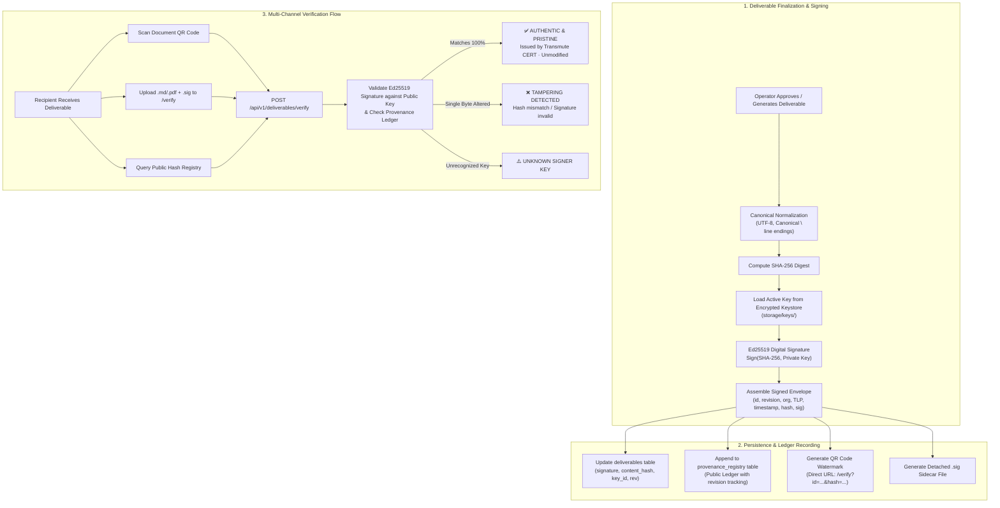

# Transmute Platform — T9: Watermarking & Tamper-Detection on Deliverables

**Date:** September 13, 2026  
**System:** Transmute Multimodal Threat Intelligence & Content Synthesis Platform  
**Feature:** Task T9 — Cryptographic Watermarking, Notary Seals & Tamper-Detection  
**Status:** Completed & Verified  

---

## 1. Executive Overview

In threat intelligence sharing and multi-tier supply chain workflows, advisories and incident reports frequently circulate across organizations, partners, and public portals. Ensuring that deliverables remain **100% authentic**, traceable to the issuing authority, and **unmodified in transit** is mission-critical.

Task **T9 (Watermarking & Tamper-Detection on Deliverables)** equips Transmute with an unforgeable digital notary seal. Every deliverable generated by the platform is:
1. **Cryptographically signed** using modern, high-speed **Ed25519** asymmetric cryptography over its canonical **SHA-256** digest.
2. **Indexed in a Public Provenance Registry**, proving authenticity and issuance without exposing document text.
3. **Stamped with a scannable QR code watermark** that allows mobile or scanner verification via the platform portal.
4. **Packaged with a detached `.sig` sidecar file** for independent or air-gapped cryptographic validation.
5. **Verifiable via a dedicated public portal (`/verify`)** supporting file uploads, text pasting, and hash queries.

---

## 2. Cryptographic & Security Architecture



### 2.1. Cryptographic Details
* **Algorithm:** `Ed25519` via Python's `cryptography` library (`cryptography.hazmat.primitives.asymmetric.ed25519`).
* **Canonical Content Normalization:** Content strings undergo canonical line-ending normalization (`\r\n` $\rightarrow$ `\n`) and UTF-8 encoding before hashing. This prevents false positive tamper flags caused by cross-platform Git or Windows/Linux CRLF conversions.
* **Pre-Hashed Signing Standard:** Digital signatures are computed over the 64-character lowercase hexadecimal SHA-256 digest string, ensuring fast execution and interoperability.
* **Encrypted Key Storage:** Private keys are stored at rest under `storage/keys/` encrypted using `AES-256-GCM` with random 96-bit nonces. Master keys are securely derived from `SIGNING_MASTER_KEY` or a filesystem-protected `0600` master key file.
* **Key Rotation & Historical Compatibility:** Rotating keys generates a new active key ID while retaining older public verification keys in PEM format so historical advisories remain verifiable indefinitely.

---

## 3. Implementation Details

### 3.1. Backend Architecture

#### 1. Signing Service (`backend/services/signing.py`)
* Implements `SigningService` handling key generation, AES-GCM encryption/decryption, Ed25519 signing, verification, and key rotation.
* Generates scannable PNG QR code data URLs (`data:image/png;base64,...`) pointing directly to `/verify?id={id}&hash={hash}`.
* Emits pretty-printed JSON detached `.sig` sidecars.

#### 2. Database Models & Auto-Migration (`backend/models/` & `backend/database.py`)
* **`backend/models/deliverable.py`:** Added columns to `deliverables` table:
  * `signature`: Text (Base64 signature)
  * `signing_key_id`: String(64)
  * `content_hash`: String(64) (Indexed SHA-256 hash)
  * `signature_metadata_json`: Text (Full signed envelope)
  * `revision`: Integer (Revision counter)
* **`backend/models/provenance_registry.py`:** Created `ProvenanceRegistryRecord` mapped to `provenance_registry` table for storing historical hashes and signatures across revisions.
* **SQLite Auto-Migration:** Updated `init_db()` in `backend/database.py` with non-destructive `PRAGMA table_info` schema inspection and `ALTER TABLE` execution.

#### 3. Deliverable Service Integration (`backend/services/deliverable_service.py`)
* In `generate_and_persist_deliverable()`, canonicalizes deliverable text, signs it with the active Ed25519 key, saves signature fields to `DeliverableRecord`, and registers an entry into `ProvenanceRegistryRecord`.
* Added `create_revision()`: When an operator modifies or retries a deliverable, increments the revision number, recalculates the SHA-256 digest, re-signs with the active key, and appends the new revision to the ledger.

#### 4. REST Endpoints (`backend/routers/signing.py` & `backend/main.py`)
Registered under prefix `/api/v1/deliverables`:
* `POST /api/v1/deliverables/verify`: Accepts JSON payload OR multipart form (`file` + `.sig` sidecar). Verifies signature and queries the provenance ledger.
* `GET /api/v1/deliverables/registry/{hash_or_id}`: Public registry query for provenance validation without exposing document content.
* `GET /api/v1/deliverables/public-keys`: Lists all active and historical public verification keys.
* `GET /api/v1/deliverables/public-keys/{key_id}`: Exports raw SubjectPublicKeyInfo PEM string.
* `GET /api/v1/deliverables/{id}/signature`: Retrieves envelope metadata and QR code data URL.
* `GET /api/v1/deliverables/{id}/sidecar`: Downloads detached `<output_type>_<id>.sig` file.
* `POST /api/v1/deliverables/{id}/re-sign`: Re-signs deliverable upon content modifications.

---

### 3.2. Frontend Architecture

#### 1. Public "Verify Authenticity" Page (`frontend/src/pages/VerifyAuthenticity.tsx`)
Accessible to supply chain partners and recipients without logging in:
* **Mode 1 (File + Sidecar Upload):** Drag-and-drop or browse deliverable (`.md`, `.txt`, `.pdf`) and optional `.sig` sidecar.
* **Mode 2 (Direct Content & Signature Paste):** Textareas for pasting raw markdown and Base64 signature string.
* **Mode 3 (Registry Lookup):** Direct lookup by SHA-256 hash or Deliverable UUID.
* **Mobile QR Auto-Verification:** Inspects query parameters (`?id=...&hash=...`) on page load and automatically triggers verification when scanned by a phone camera.
* **Dynamic Certificate Cards:**
  * 🟢 **AUTHENTIC & VERIFIED:** Displays verified shield, originating organization, certified UTC timestamp, TLP classification badge, and proof that not a single byte was altered.
  * 🔴 **TAMPERING DETECTED:** Highlights hash mismatch, warning that the advisory was modified or forged in transit.

#### 2. Stage 3 Deliverables Card Integration (`frontend/src/pages/Dashboard.tsx`)
* **Signature Badge:** Added `🛡️ Signed & Authentic [Rev #1]` certificate badge next to each deliverable tab.
* **Provenance Seal Modal:** Clicking the badge opens a modal showing:
  * Signer Key ID and TLP classification.
  * Full canonical SHA-256 fingerprint with 1-click copy.
  * Rendered scannable QR Code watermark.
  * Direct link to the public verification portal.
* **Toolbar Actions:**
  * `Download .md`: Saves clean deliverable text.
  * `Download .sig`: Directly downloads detached cryptographic sidecar file.
  * `Save changes & Re-sign`: Re-signs the modified deliverable on save and updates the revision counter.
* **Top Navigation Bar:** Added direct link `🛡️ Verify Authenticity` leading to `/verify`.

#### 3. Network & Offline Resilience Fix (`frontend/src/lib/mock.ts`)
* Fixed an issue where an offline backend caused `generatePlan` and `generateDeliverable` to throw blocking `NetworkError when attempting to fetch resource` dialogs.
* Implemented graceful fallback: If the backend is unreachable, the client logs a warning and smoothly proceeds with the grounded offline preview and deliverable engine.

---

## 4. File Manifest & Summary of Changes

| File | Status | Description |
|---|---|---|
| `backend/services/signing.py` | **NEW** | Ed25519 signing, verification, AES-GCM keystore, and QR generation. |
| `backend/models/provenance_registry.py` | **NEW** | Model for the public provenance registry ledger. |
| `backend/routers/signing.py` | **NEW** | Endpoints for verification, public keys, sidecars, and registry queries. |
| `frontend/src/pages/VerifyAuthenticity.tsx` | **NEW** | Dedicated public verification portal page. |
| `tests/test_signing_and_tamper_detection.py` | **NEW** | Automated test suite verifying signing, tamper detection, and APIs. |
| `T9_WATERMARKING_AND_TAMPER_DETECTION.md` | **NEW** | Comprehensive documentation and architecture specification. |
| `backend/models/deliverable.py` | Modified | Added signature, key_id, content_hash, metadata, and revision fields. |
| `backend/models/__init__.py` | Modified | Exported `ProvenanceRegistryRecord`. |
| `backend/config.py` | Modified | Added `KEYS_DIR`, `SIGNING_MASTER_KEY`, and verification settings. |
| `backend/database.py` | Modified | Added automatic SQLite schema migrations for deliverables table. |
| `backend/services/deliverable_service.py` | Modified | Integrated signing on generation and added `create_revision()`. |
| `backend/schemas/pipeline.py` | Modified | Added signature and watermark fields to `DeliverableResponse`. |
| `backend/routers/__init__.py` | Modified | Exported `signing_router`. |
| `backend/main.py` | Modified | Registered `signing_router` with FastAPI app. |
| `frontend/src/App.tsx` | Modified | Added route `/verify` for `VerifyAuthenticity`. |
| `frontend/src/index.css` | Modified | Added styling for signature badge, verification portal, and modal. |
| `frontend/src/lib/types.ts` | Modified | Extended `Deliverable` interface with signature metadata. |
| `frontend/src/lib/mock.ts` | Modified | Added verification APIs and offline network resilience. |
| `frontend/src/pages/Dashboard.tsx` | Modified | Added signature badge, seal modal, sidecar download, and re-signing. |

---

## 5. Verification & Testing

### 5.1. Automated Test Suite
Ran `python3 -m unittest tests/test_signing_and_tamper_detection.py`:
* `test_keypair_generation_and_encryption`: **PASSED** (AES-GCM encryption verified)
* `test_sign_and_verify_authentic`: **PASSED** (Ed25519 signature + QR generation verified)
* `test_tamper_detection_breaks_signature`: **PASSED** (Modifying 1 character triggers `TAMPERED` / `HASH_MISMATCH`)
* `test_key_rotation_preserves_historical_verification`: **PASSED** (Historical keys verify older advisories)
* `test_deliverable_service_persists_signature_and_provenance`: **PASSED** (Persistence & revision ledger verified)
* `test_api_verify_endpoints`: **PASSED** (JSON and multipart verification endpoints verified)

```
Ran 6 tests in 0.228s
OK
```

### 5.2. Pre-Existing Test Verification
All existing tests passed with zero regressions:
* `tests/test_strip_preview_wrappers.py`: **PASSED**
* `tests/test_interactive_sensitivity.py`: **PASSED**
* `tests/test_proofchecker_deterministic.py`: **PASSED**

---

## 6. How to Run the System

### Run Both Backend & Frontend
```bash
cd /home/samyakjain/Desktop/SIH/SIH-BACKUP
./run_servers.sh
```

### Run Backend Only
```bash
cd /home/samyakjain/Desktop/SIH/SIH-BACKUP
python3 server.py
```
* Backend API: `http://localhost:8000`
* Swagger Documentation: `http://localhost:8000/docs`
* Verification Portal: `http://localhost:5173/verify`

### Run Test Suite
```bash
python3 -m unittest tests/test_signing_and_tamper_detection.py
```
